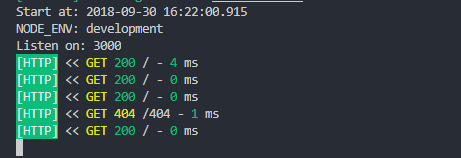

# typescript-koa

这是一个 typescript koa 实践案例。



## start

**install**

```ls
npm install
# or
yarn install
```

**lint**

```ls
npm run lint
```

> vscode 默认不会检测 eslint，需要在配置里开启ts检测

```json
"eslint.validate": [
  "javascript",
  "javascriptreact",
  "typescript"
]
```

**development**


```ls
npm run dev
```

Hot update development.

**compile**

```ls
npm run compile
```

It't will output to `dest` dir.
